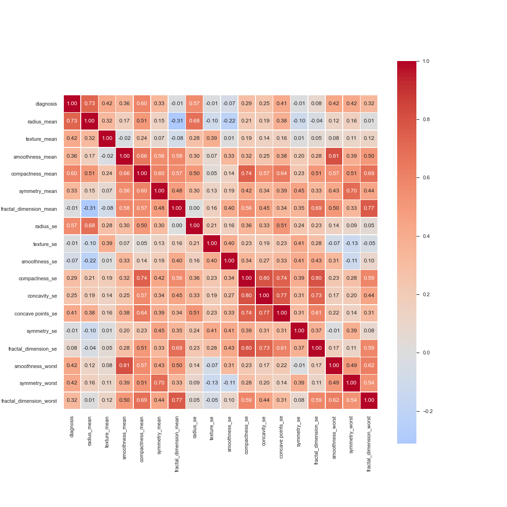
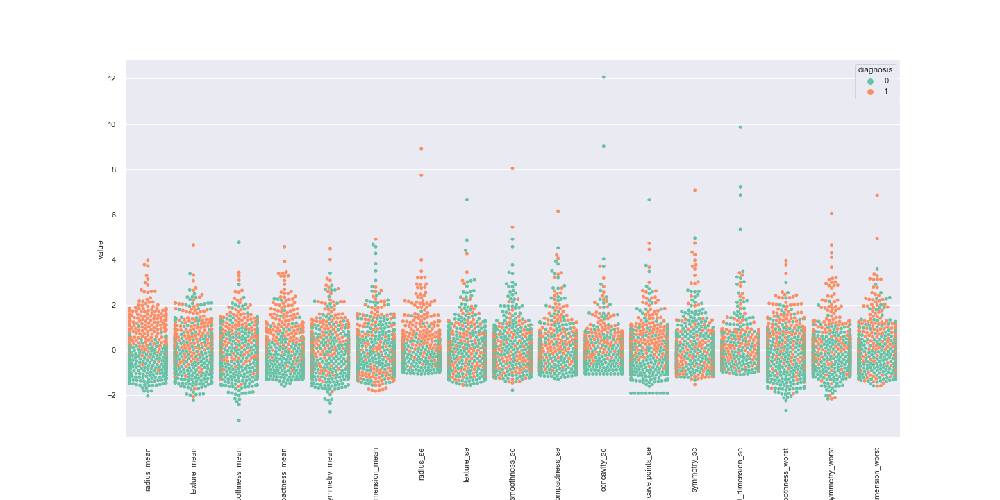
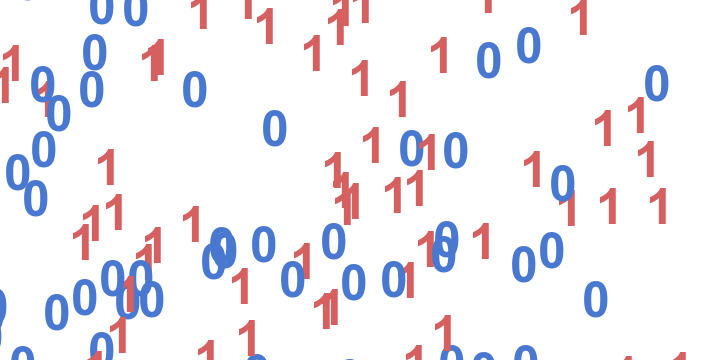

## Breast cancer prediction

### Context

This dataset is available through [Kaggle](https://www.kaggle.com/uciml/breast-cancer-wisconsin-data)

Features are computed from a digitized image of a fine needle aspirate (FNA) of a breast mass. They describe characteristics of the cell nuclei present in the image. 
The 3-dimensional space is that described in: [K. P. Bennett and O. L. Mangasarian: "Robust Linear Programming Discrimination of Two Linearly Inseparable Sets", 
Optimization Methods and Software 1, 1992, 23-34].

For this project, we'll use machine learning to try to predict whether a cancer cell is benign or malignant based on a variety of cell attributes that were 
computed for each cell nucleus.

### About the dataset
This dataset contains 569 entries with 31 attibutes that can be used to predict whether a cancer cell is benign or malignant.

### Kernel content
The kernel is divided into 3 separate parts: 

     1. Import dependencies and load the dataset
     2. Exploratory Data Analysis (EDA)
     3. Building prediction model

### Findings
Below is the correlation matrix between vairables in the dataset after taking multicollinearity into consideration

The chart below was created during EDA process that plots each feature against the target variable

We applied PCA during the process to reduce the number of features from 31 to 8 components, and plot those components on a 2D plot

### Modeling
4 different machine learning models were used and compared to predict mortality by heart failure

The best performed model is Logistic regression, with a accuracy score of about 98%, followed by SVC with a 96.5% accuracy score. To prevent over-fitting, more 
training data is hihgly recommended.

### Streamlit app
http://localhost:8501/
